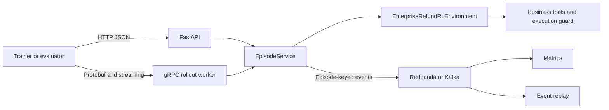

# Distributed Enterprise Control Plane

## Purpose

This extension preserves one deterministic environment contract while
adding production-shaped transport and event boundaries:

- FastAPI for episode lifecycle, inspection, and debugging;
- gRPC for typed reset, step, and bidirectional rollout streaming;
- Redpanda/Kafka for ordered audit, metrics, and replay events;
- Docker Compose for a locally deployable multi-process stack.

It is a tested deployment prototype, not a production-ready distributed
RL platform.

## Architecture



FastAPI and gRPC are adapters. They do not reimplement environment,
reward, evaluator, or guard behavior. The shared `EpisodeService` owns:

- environment instances and episode lifecycle;
- a lock that serializes actions within each episode;
- request-id caching and conflict detection;
- monotonically increasing event sequence numbers;
- transport-independent domain-event publication.

## FastAPI contract

```text
GET  /healthz
POST /v1/episodes
GET  /v1/episodes/{episode_id}
POST /v1/episodes/{episode_id}/steps
```

Stable error mappings include:

| Condition | HTTP status |
|---|---:|
| Unknown episode | `404` |
| Reused request ID with different action | `409` |
| Invalid case, architecture, or action | `400` |
| Pydantic request-schema failure | `422` |

## gRPC contract

The protobuf service exposes:

```protobuf
rpc Reset(ResetRequest) returns (ResetResponse);
rpc Step(StepRequest) returns (StepResponse);
rpc RunEpisode(stream StepRequest) returns (stream StepResponse);
```

Domain errors map to stable gRPC codes:

| Condition | gRPC status |
|---|---|
| Unknown episode | `NOT_FOUND` |
| Reused request ID with different action | `ALREADY_EXISTS` |
| Invalid case, architecture, or action | `INVALID_ARGUMENT` |

The checked-in Python bindings are generated from
`enterprise_eval/distributed/proto/control_plane.proto`.

## Idempotency and irreversible actions

Each step carries a caller-supplied `request_id`. The service hashes the
action type and canonical JSON arguments:

1. unseen request ID: execute once and cache the transition;
2. same request ID and same action: return the cached transition;
3. same request ID and different action: reject the request.

This is process-local idempotency. It proves transport retries do not
double-dispatch a refund within the running service. A production system
would persist the idempotency record in the same durable transaction as
episode state.

## Kafka-compatible event contract

Events use schema version `control-plane-event.v1` and contain:

```json
{
  "schema_version": "control-plane-event.v1",
  "event_id": "uuid",
  "episode_id": "episode-id",
  "sequence": 3,
  "event_type": "reward.assigned",
  "state_fingerprint": "sha256",
  "payload": {}
}
```

The episode ID is also the Kafka message key, preserving per-episode
partition ordering. Consumers still validate the explicit sequence
number so missing or duplicate events are observable.

A successful five-action refund episode produces 12 events:

- one `episode.started`;
- five `action.requested`;
- five `reward.assigned`;
- one `episode.completed`.

The event replay path reconstructs actions from the log, executes them
against a fresh deterministic environment, and compares the resulting
state fingerprint with the original terminal fingerprint.

## Reproduce

Install the distributed dependencies:

```bash
python -m pip install -e ".[dev,distributed]"
```

Start the complete stack:

```bash
docker compose up --build -d
docker compose ps
```

Run the proof:

```bash
python scripts/run_distributed_control_plane_demo.py
```

Expected output:

```text
REST final fingerprint:   cc445b8608da8196
gRPC final fingerprint:   cc445b8608da8196
Transport parity:         PASS
Duplicate refund blocked: PASS
Kafka events observed:    12
Event sequence gaps:      0
Replay parity:            PASS
Guard rejection emitted: PASS
```

The demo writes:

```text
artifacts/distributed_control_plane/demo.json
```

Stop the local stack:

```bash
docker compose down
```

## Evidence

The automated suite covers:

- in-memory event ordering and schema identity;
- episode concurrency and request idempotency;
- HTTP lifecycle, errors, and guard propagation;
- gRPC unary and bidirectional-streaming behavior;
- REST/gRPC terminal fingerprint parity;
- Kafka serialization, metrics, and sequence-gap detection;
- event-log replay to the original fingerprint.

The Docker demo additionally exercises real processes and a real
Kafka-compatible Redpanda broker.

## Limitations

- Episode state and idempotency records are process-local and disappear
  on restart.
- State mutation and Kafka publication are not joined by a transactional
  outbox; a broker failure between them can create dual-write ambiguity.
- The Compose deployment uses one development-mode Redpanda broker.
- HTTP and gRPC are intentionally plaintext and unauthenticated.
- There is no tenant isolation, quota enforcement, or privacy-aware
  retention policy.
- Horizontal scaling requires durable shared state or episode-affinity
  routing.
- Event replay is deterministic for this controlled environment; it is
  not a general event-sourcing framework.
- The environment remains one synthetic refund domain rather than a
  heterogeneous collection of business simulations.

These boundaries are why the result is described as a
production-shaped, locally deployable control-plane prototype rather
than a production-ready platform.
