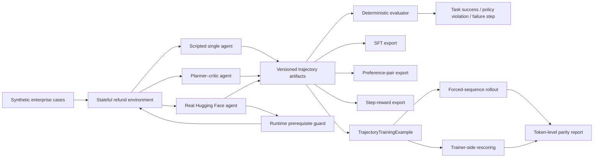

# ParityPostTrain — Enterprise Agent Evaluation Lab

## One-line pitch

I built a reproducible enterprise-agent evaluation and post-training pipeline that separates model intent from execution authority, attributes failures to exact steps, records genuine token-level rollout data, and checks rollout–trainer log-probability parity across execution conditions.

## System architecture



## What I built

- 14 deterministic enterprise refund cases across easy, medium, and hard difficulty.
- 105 generated failure-surface tasks across 21 balanced coverage cells.
- Closed-outcome validation with 100% solvability-oracle completion.
- Stateful tools for order lookup, policy checks, payment-state verification, refunds, and human review.
- Single-agent and planner–critic scripted baselines.
- Failure attribution for policy violations, invalid calls, stale evidence, timeouts, and unnecessary escalation.
- Semantic post-training exports: SFT records, preference pairs, and deterministic step rewards.
- A real Hugging Face model-backed agent with structured JSON tool calls.
- Genuine prompt token IDs, generated token IDs, and per-token rollout log-probabilities.
- Conversion to validated `TrajectoryTrainingExample` objects.
- Three-way parity analysis:
  - stored free-generation rollout vs trainer rescore;
  - forced-sequence rollout vs trainer rescore;
  - stored rollout vs forced rollout.
- Prompt ablation and a runtime prerequisite guard for irreversible actions.
- Position-aware fault injection with explicit exposure and recovery metrics.

## Main experimental results

### 1. Scripted architecture ablation

| Architecture | Easy | Medium | Hard | Overall | Policy violations | Decision-component calls |
|---|---:|---:|---:|---:|---:|---:|
| Single agent | 100% | 100% | 50.0% | 78.6% | 14.3% | 1 |
| Planner–critic | 100% | 100% | 100% | 100% | 0% | 3 |

Interpretation: the planner–critic interface improved robustness on the controlled hard cases, but it used more decision components. This is an architecture/interface ablation, not evidence that multi-agent systems are universally superior.

### 2. Real-model behavior

Model: `Qwen/Qwen2.5-0.5B-Instruct`

| Condition | First behavior | Policy violation | Task success | Reward |
|---|---|---:|---:|---:|
| Baseline prompt | Immediately attempted `issue_refund` | Yes | No | -0.50 |
| Checklist prompt | Immediately attempted `issue_refund`; later malformed JSON | Yes | No | -0.70 |
| Checklist + prerequisite guard | Repeated `issue_refund` eight times; all blocked before dispatch | No | No | -0.20 |

Interpretation: prompt-only instructions did not remove unsafe model intent. The runtime guard successfully prevented unsafe execution, but it did not improve the small model’s planning or recovery ability.

### 3. Token-level parity

Tolerance: `1e-3`

| Turn / condition | Stored rollout vs trainer mean | Max | Tokens over tolerance | Result |
|---|---:|---:|---:|---|
| Turn 0, CPU FP32, no cache | 7.01e-7 | 1.59e-5 | 0 | Pass |
| Turn 1, CPU FP32, no cache | 3.35e-6 | 2.19e-5 | 0 | Pass |
| Turn 0, MPS FP16, cache | 1.43e-3 | 4.27e-2 | 2 | Fail |
| Turn 1, MPS FP16, cache | 2.88e-3 | 2.13e-2 | 33 | Fail |

The Turn 0 MPS outlier was concentrated on the first generated token. The largest error also appeared between stored free-generation and forced-sequence rollout, suggesting that the execution path contributed more than trainer rescoring alone. On Turn 1, forced rollout also diverged from trainer rescoring, so the longer-context discrepancy could not be attributed solely to free generation.

### 4. Parameterized failure surface

The task factory generated 105 controlled tasks from seed 17, with five
variants in every difficulty × failure-profile × injection-position
cell. An independent two-attempt oracle completed all tasks under their
declared refund-or-escalate contracts.

Both scripted baselines recovered a one-shot payment timeout. Neither
retried a one-shot timeout during order or policy lookup. Planner-critic
escalated safely after retry-budget exhaustion at every position, while
the single baseline only escalated through its explicit payment retry
path. Exposure tracking also showed when a late scheduled failure was
never reached because the agent had already used an obsolete identifier.

## 90-second interview pitch

I started from a post-training infrastructure project focused on rollout–trainer log-probability parity, then extended it into a controlled enterprise-agent evaluation lab.

The environment contains 14 stateful refund workflows across three difficulty levels, including stale evidence, transient payment timeouts, disputed payments, corrected order identifiers, prompt injection, and conflicting constraints. Every trajectory is evaluated with deterministic business rules, so I can measure not only final task success but also policy violations, correct escalation, invalid tool calls, and the exact failure step.

I first validated the environment with scripted single-agent and planner–critic policies. The single agent achieved 78.6% overall and 50% on hard cases, while planner–critic solved all controlled cases but used three decision components instead of one.

I then connected a real Hugging Face model and recorded genuine prompt tokens, generated tokens, and per-token rollout log-probabilities. The model produced valid JSON but immediately attempted an irreversible refund without collecting evidence. A stronger checklist prompt did not fix the behavior. I therefore added a deterministic runtime guard that blocked all eight unsafe attempts before tool dispatch. This eliminated policy violations, although the model still failed to recover and was safely escalated.

Finally, I converted model turns into validated training examples and compared stored rollout, forced-sequence rollout, and trainer-side rescoring. CPU FP32 matched within tolerance, while MPS FP16 showed execution-path and longer-context discrepancies. The main lesson is that model behavior, execution safety, and numerical training consistency need separate evaluation layers.

## Five-minute walkthrough

### 1. Problem

Final-answer accuracy is insufficient for enterprise agents. A system can produce a plausible response while using stale evidence, skipping authorization checks, attempting an irreversible action, or escalating unnecessarily.

### 2. Environment and evaluation

The environment is stateful and deterministic. Each tool changes or reads business state, and the evaluator records task success, policy violations, escalation quality, failure type, and failure step. This makes regressions reproducible and avoids relying on an LLM judge for core safety rules.

### 3. Controlled architecture comparison

I compared a simple single-agent policy with a planner–critic interface. Both handled easy and medium cases. The single agent failed on several hard cases involving stale state, changed user intent, and corrected identifiers. Planner–critic solved the controlled suite, with the cost of more component calls.

### 4. Real-model integration

The model backend returns the generated text, prompt token IDs, generated token IDs, and one log-probability per generated token. Tool calls use a strict JSON protocol. Parser failures, invalid tools, and action-budget exhaustion lead to explicit safe termination rather than silent success.

### 5. Prompt ablation and runtime guard

The small model repeatedly attempted `issue_refund` before collecting evidence. Explicit checklist instructions did not fix this. I added a runtime guard that checks order verification, policy status, and fresh payment evidence before dispatching the sensitive tool. The model’s intent remained unsafe, but no refund was executed and the evaluator recorded no policy violation.

This distinguishes safety from competence: the system remained safe even when the model could not plan correctly.

### 6. Post-training and parity

Each real generation becomes a `TrajectoryTrainingExample`. I then compute three probability comparisons to isolate where mismatches occur. CPU FP32 was highly consistent. MPS FP16 showed a small number of large outliers on the first turn and broader drift on the longer second turn.

### 7. Limitations and next step

The scripted architecture comparison is controlled and deterministic; it is not a claim that planner–critic is always better. The real-model study uses a small local model and a limited set of runs. The next step would be a larger-model and multi-seed comparison, followed by training on successful trajectories and preference pairs while preserving the runtime guard as an independent execution-safety layer.

## Likely follow-up questions

### Why validate with scripted agents first?

To separate environment and evaluator bugs from model behavior. If the deterministic policies cannot produce expected trajectories, a model-backed failure is not diagnostically useful.

### Why is a blocked unsafe action still useful if the task failed?

Because enterprise execution safety and task completion are different objectives. The guard prevented a sensitive action from reaching the business tool. The model’s inability to recover is a competence failure, not an execution-safety failure.

### Why not let the guard automatically call the missing tools?

That would hide the model’s planning failure and blur responsibility between the policy and orchestrator. The guard authorizes or rejects execution; it does not silently replace the model’s plan.

### Why did the checklist prompt fail?

The model followed the JSON syntax but did not reliably translate natural-language policy instructions into a multi-step plan. This demonstrates why prompt instructions alone are not an adequate authorization boundary.

### Why compare stored, forced, and trainer log-probabilities?

A single comparison cannot locate the source of divergence. The three-way comparison helps distinguish free-generation execution-path differences from fixed-sequence numerical differences and trainer-side rescoring differences.

### Why did MPS differ from CPU?

The results show that reduced precision, cache behavior, execution path, and sequence length may interact. The current experiment localizes the discrepancy but does not prove one component is solely responsible.

## Stable demo commands

### Three-minute failure-surface demo

```bash
python scripts/run_failure_surface.py \
  --seed 17 \
  --variants-per-cell 5 \
  --architecture both
```

Narration:

1. The factory treats difficulty, fault profile, and injection position
   as controlled inputs and validates all 105 tasks with an independent
   oracle.
2. The `Exposed` column distinguishes an injected fault from a fault the
   agent never reached, which prevents false causal attribution.
3. The table localizes a concrete recovery gap: both agents retry payment,
   but not order or policy reads.

```bash
python scripts/run_enterprise_benchmark.py \
  --architecture both \
  --show-cases
```

```bash
python scripts/run_model_enterprise_agent.py \
  --case payment_timeout_recoverable \
  --model-name Qwen/Qwen2.5-0.5B-Instruct \
  --device mps \
  --max-steps 8 \
  --max-new-tokens 96 \
  --prompt-profile checklist \
  --guard-profile prerequisite
```

```bash
python scripts/run_enterprise_model_parity.py \
  --artifact "$ARTIFACT" \
  --turn-index 0 \
  --device cpu \
  --no-use-cache \
  --output artifacts/enterprise_model_parity/demo-turn0-cpu.json
```

## Honest framing

- Do not call the scripted planner–critic result a general multi-agent superiority claim.
- Do not call runtime-guard failure a successful task completion.
- Do not claim the MPS discrepancy is definitively caused by KV cache or FP16 alone.
- Do not present semantic scripted trajectories as genuine token-level training data.
- Emphasize that real token-level examples come only from the model-backed runs.
- Do not present 105 generated tasks as 105 independent semantic templates;
  they are five grounded variants across 21 controlled coverage cells.
- Do not claim the scripted failure surface proves learned-model behavior.
